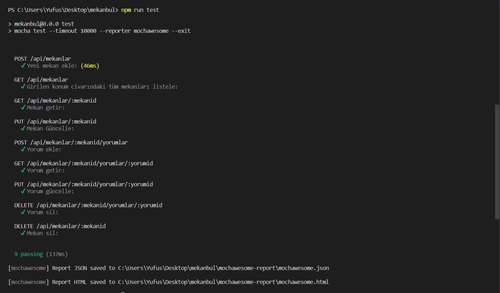

# Mekanbul Uygulaması
---
- **Mekanbul:** Süleyman Demirel Üniversitesi web teknolojileri ve programlama dersinde yapmış olduğumuz insanların konumları civarındaki mekanları, sunduğu imkanları görmelerini, mekanlara yorum yapabilmelerini sağlayan bir web uygulamasıdır.
- Uygulamanın aynı zamanda bir admin paneli mevcuttur. Admin mekan ekleme, mekan silme, mekan güncelleme, tüm mekanları görme gibi işlemleri yapabilmektedir.
---
## Uygulama Özellikleri

1. Enlem ve Boylama göre mekanların uzaklıklarını belirleme.
2. Giriş yapan kullanıcıların mekanlara yorum yapması ve yıldız vermesi.
3. Adminin mekan ekleme,mekan çıkarma,mekan güncelleme,özelliklerinin olması.
4. Giriş yapma ve kayıt olma pencereleri.
---
## Kullanılan Teknolojiler ve Araçlar
Uygulama ***front-end*** ve ***back-end*** olmak üzere iki kısımdan oluşmaktadır. **MVC** mimarisine uygun bir şekilde tasarlanmıştır.

- Front-end: PugJS, CSS, JQuery
- Back-end: NodeJS, ExpressJS, Javascript
- Veritabanı: MongoDB
- Veri Modelleme: Mongoose
- Kimlik Doğrulama, Güvenlik: PassportJS, JWT
- Haberleşme: REST API, Axios
- Test: Mocha,Mochawesome, Chai, Supertest
- IDE: Visual Studio Code
- REST API Client: Thunder Client
- Versiyonlama: Git
---
### Gerekli Kütüphanelerin Eklenmesi
```
npm install
```
### Uygulamanın Çalıştırılması
```
npm start
```
### Api Testi İçin
```
npm run test
```
- Uygulama http://localhost:3000 adresinde çalışmaktadır. Anasayfaya erişmek için enlem ve boylam parametreleri verilmelidir.
Örnek:http://localhost:3000/?enlem=37.8&boylam=35
- Mongo Cloud benzeri bir veritabanı kullanılacaksa "app_api/models/db.js" dosyasındaki dbURI değiştirilmeli.

- Uygulama localhost yerine domain altında çalışacaksa "app_server/controllers/mekanlar.js" dosyasındaki apiSecenekleri.sunucu parametresini değiştirilmeli.
---
## API Metotları
Tüm koleksiyon thunder-collection_Yusuf Dagdeviren Mekanbul API Testi .json dosyasında yer almaktadır. Thunder Client aracılığı ile import edilebilir.

- ***Mekan Ekleme***: POST "/api/admin/mekan/yeni". Mekan bilgileri girilmeli. Mekan Bilgileri: ad,adres, imkanlar, enlem, boylam, gunler1, acilis1, kapanis1, kapali1, gunler2, acilis2, kapanis2, kapali2.
- ***Konuma Göre Mekan Listeleme***: GET "/api/mekanlar?enlem=37&boylam=35". Enlem ve boylam sorgu parametresi olarak verilmeli.
- ***Tüm Mekanları Listeleme***: GET "/api/admin/mekanlar". Giriş yapılmalı.
- ***Mekan Getir***: GET "/api/mekanlar/:mekanid".
- ***Mekan Güncelle***: PUT "/api/mekanlar/:mekanid". Auth.Bearer Token Girilmeli. Mekan bilgileri girilmeli. Mekan Bilgileri: ad,adres, imkanlar, enlem, boylam, gunler1, acilis1, kapanis1, kapali1, gunler2, acilis2, kapanis2, kapali2.
- ***Mekan Sil***: DELETE "/api/mekanlar/:mekanid". Auth.Bearer Token Girilmeli.
- ***Yorum Getir***: GET "/api/mekanlar/:mekanid/yorumlar/:yorumid".
- ***Yorum Ekle***: POST "/api/mekanlar/:mekanid/yorumlar". Auth.Bearer Token Girilmeli. Yorum bilgileri girilmeli. Yorum Bilgileri: yorumMetni, puan
- ***Yorum Sil***: DELETE "/api/mekanlar/:mekanid/yorumlar/:yorumid". Auth.Bearer Token Girilmeli
- ***Giriş Yap***: POST "api/admin/girisyap". Auth.Bearer Token Girilmeli. Kullanıcı bilgileri girilmeli. Kullanıcı Bilgileri: eposta, sifre.
- ***Kayıt Ol***: POST "api/admin/kayitol". Auth.Bearer Token Girilmeli. Kullanıcı bilgileri girilmeli. Kullanıcı Bilgileri: adsoyad, eposta, sifre.
---
## Ekran Görüntüleri
1. **Anasayfa**

2. **Mekan Sayfası**

3. **Yorum Ekle Sayfası**

4. **Admin Giris Yap Sayfasi**

5. **Admin Kayıt Olma Sayfası**

6. **Admin Ana Sayfası**

7. **Admin Mekan Ekleme Sayfası**

8. **Admin Mekan Güncelle Sayfası**

9. **Admin Mekan Silme Sayfası**

10. **Mocha Api Testi**

11. **Thunder Api Testi**


#### Dipnot
- Bu proje ders boyunca hocamızın anlatımıyla ve kendi çabamla verilen ödevleri yaparak ilerlememin bir sonucudur eksikler olabilir.
- Projenin tam hali için hocamızın proje linki [Asım Sinan Yüksel Mekanbul Full-Stack](https://github.com/asimsinan/mekanbul-fullstack)